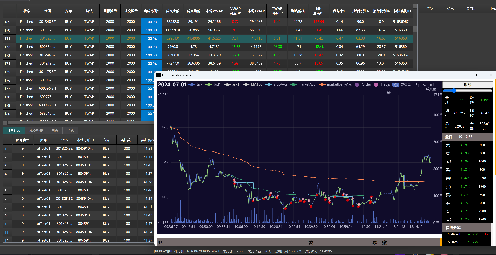
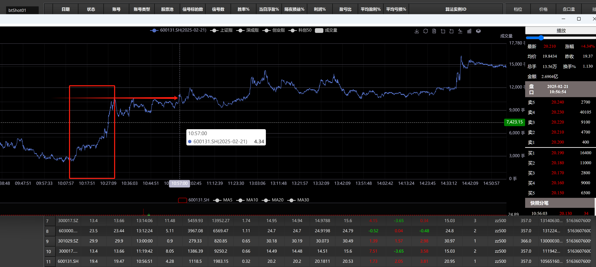

    
    
    
    

#### What is AlgoPulse
* **`AlgoPulse` is an algorithmic trading execution backend developed in `C++` (supporting Windows/Linux). Users can build upon the basic framework and existing algorithms to implement their own execution ideas or develop intraday trading strategies (T0 or pair trading).**
    - `✓` Implements typical TWAP/VWAP algorithm execution examples and is extensible to support intraday trading strategies (limit-up chasing/T0/event-driven...) and market-making strategies, etc.
    - `✓` Currently integrates internet real-time market data, enabling complete simulation and backtesting of algorithmic trading strategies.
    - `✓` Data is stored in HDF5 format: daily static security information, Level 1 market data, daily quotes, and minute quotes.
    - `✓` As a backend program, the frontend can communicate with it via TCP connections and defined Protobuf message bodies.
    - `✘` Live trading requires implementing related classes (such as `QuoteFeedLive` and `OrderBook`, etc.) based on the connected brokerage.
    
* Unlike typical quantitative backtesting frameworks that focus on daily or minute-level trading and backtesting, this framework is specifically designed for Tick snapshot-level trading and backtesting. Therefore, it does not provide complete multi-trading-day account backtesting curve analysis. Instead, it focuses on:
    - `✓` For algorithmic trading: primarily tracking slippage backtesting analysis (mainly VWAP slippage, TWAP slippage, arrival price slippage, etc.)
    - `✓` For intraday trading: primarily profit/loss ratio, win rate, excess return, etc.
    - `✓` Signals generated by intraday strategies can be converted into algorithmic orders for execution (via the `AlgoPlacer` class), which aggregates them into a single Order callback to the strategy, avoiding the need for the strategy to handle multiple sub-orders.
    - `✓` When backtesting an algorithm or strategy across the entire market, it will group by stock to generate multiple sub-tasks for multi-threaded backtesting before aggregating the results.
    
    

### Algorithmic Trading Execution: Combining Tick Market Data Drive with Timers
* Due to poor liquidity in some stocks, tick updates may only occur every tens of seconds or minutes. Relying solely on market data broadcasts to drive algorithm execution can sometimes be insufficient. Therefore, this project leverages C++ coroutines and incorporates timers as a supplement.
* Given a specified duration for an algorithmic trading order, it is generally divided into multiple time segments (slices). Execution progress tracks TWAP, VWAP, or POV.
 
        for (auto& slicer : slicers) {
            curSlicerIndex = slicer.index;
            co_await executeSlicer(slicer);
        }

   Meanwhile, during `onMarketDepth`, decisions on whether to use `take` or `make` orders within a slice can be made based on order book changes or predictive signals:
    
       onMarketDepth(const MarketDepth* newMd){

            algoPerf.performanceSummay(newMd);
            executeSignal(newMd,m_md.get()); // quick act on predict LOB change if possible
        }

   If `executeSignal` is not defined, the execution of each slice is completed according to the execution progress under coroutine scheduling.
   During backtesting, when a timer is encountered, the backtesting coroutine will suspend and wait until the replayed market data reaches that timestamp, at which point the coroutine resumes execution.

### Algorithm Performance

   * VWAP slippage is influenced by multiple factors, such as the degree of order book fluctuation and market trends during the same period. Additionally, risk control constraints limit order placement and cancellation behavior. Stricter risk control compliance, such as limiting the minimum fill rate (80%) and maximum cancellation rate (20%), will result in a relatively high proportion of take orders.
   * Generally, when the fill progress significantly lags behind the expected progress, `take` orders are always prioritized. Waiting risks and market impact need to be balanced.
   * For settings of common algorithmic risk controls and policy actions, refer to the `Category_ALGO` class parameters in `config.ini`

### Intraday Trading Strategy Example (Event-Driven)

* See `shot/shotTrader`. Strategy logic:
    
    - Within a specified continuous window (N periods of 3-second quotes), if there is a rapid price surge greater than 2% followed by a slight pullback, record the highest price (H) and lowest price (L) within the window.
    - After an interval of M time (a few minutes to over ten minutes), if the price surges again and breaks through the previous high, this serves as a confirmation signal to buy.
    - If a new low or new high occurs within the continuous window period, reset H and L.
    
    Similar to the sample below: 

### Limit-Up Chasing Strategy Example

* To be updated

### Data Update

* Individual users can use East Money/QuantBox terminal to obtain free data via their Python or C++ APIs. Scripts can be found in the `data` directory.

### Project Dependencies and Build

* Both Windows and Linux use CMake and vcpkg. See `vcpkg.json` for dependent packages.
* The HDF5 library requires the thread-safe version: `hdf5[threadsafe]`.

### Client UI

Uses Python QtSide6. Not yet open-sourced.
