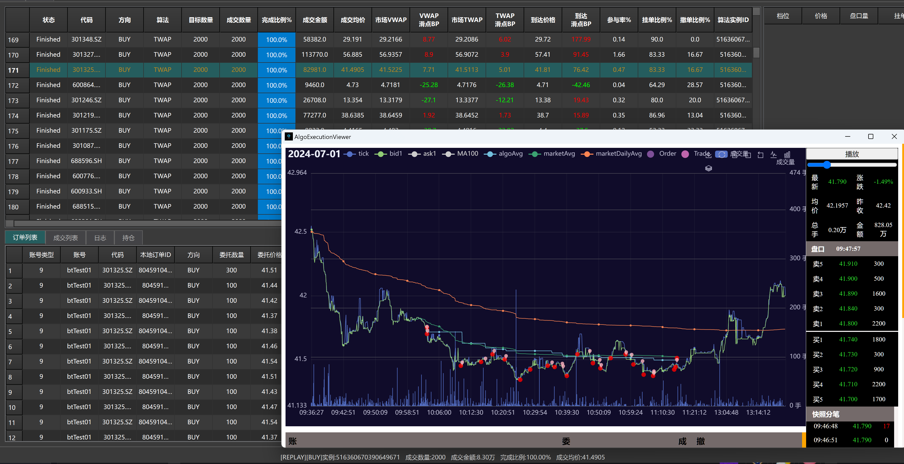
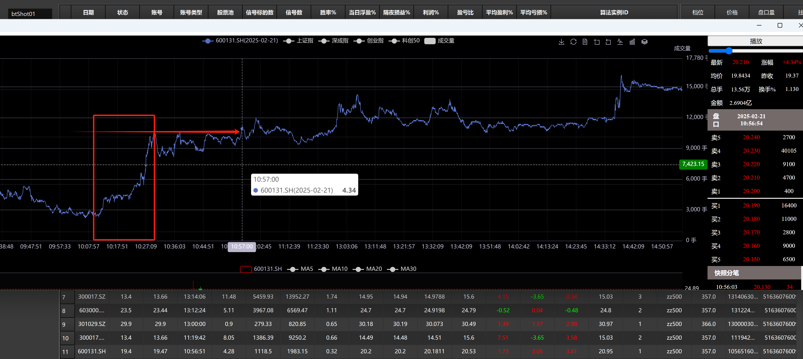

    
    
    
    

#### AlgoPulse是什么
* **`AlgoPulse`是一个基于`C++`开发的算法交易执行后端(支持windows/linux)，用户可以基于基本的框架和已有算法改进叠加自己的执行思路或开发日内交易策略(T0或配对交易）。**
    - `✓`实现典型TWAP/VWAP的算法执行示例及可拓展支持日内交易策略（打板/T0/事件驱动...）及做市策略等
    - `✓`目前集成了互联网实时行情，可以做完整的算法交易策略模拟仿真及回测
    - `✓`数据使用H5格式存储:证券每日静态信息、level 1行情数据、日行情、分钟行情
    - `✓`作为后端程序，前端可通过tcp连接及定义的protobuf消息体与该后端进行通信
    - `✘`实盘需要根据自身对接的经纪商实现相关的类(QuoteFeedLive及OrderBook等)
    
* 与一般量化回测框架主要针对日间或者分钟级别交易及回测不同，本框架完全是面向Tick行情快照级别的交易和回测，故并没有完整的账户多交易日回测曲线分析，而是:
    - `✓`对于算法交易：主要是跟踪滑动的回测分析(比如VWAP slippage、TWAP slippage、arrivePrice slippage 为主)
    - `✓`针对日内交易：主要是盈亏比、胜率、超额等
    - `✓`日内策略出现的信号可以转为算法订单进行执行(AlgoPlacer类)，其合成一个Order回报给策略，避免策略去处理多个子单的问题
    - `✓`回测一个全市场的算法或策略，会按股票分组生成多个子任务进行多线程回测再汇总
    
    

### 算法交易执行:Tick行情驱动与定时器结合
* 部分股票由于流动性很差，可能几十秒或者分钟才有tick跳动，完全基于行情广播来驱动算法执行有时候有所欠缺，故而本项目基于C++协程，加入了定时器作为补充
* 给定算法交易单的指定时长，一般将切分成多个小时段(切片slice)，执行进度跟踪TWAP或者VWAP或者POV
 
        for (auto& slicer : slicers) {
            curSlicerIndex = slicer.index;
            co_await executeSlicer(slicer);
        }

   同时onMarketDepth时，可以根据盘口变化或自己的预测信号，决策切片内委托采用take还是make:
    
       onMarketDepth(MarketDepth* newMd){

            algoPerf.performanceSummay(newMd);
            executeSignal(newMd,m_md.get()); // quick act on predict LOB change if possible
        }

   如果不定义executeSignal,则按照执行进度在协程调度下完成各切片的执行.
   回测时,遇到定时器时回测协程会挂起，等待回放行情行进至该时刻时，协程恢复执行.

### 日内交易策略示例（事件驱动）

* 见 shot/shotTrader，策略逻辑:
    
    - 在指定的连续窗口内(N个3秒行情)，如果存在快速拉升大于2%，且有所回落，窗口期内最高价H，最低价L
    - 在间隔M时间断（几分钟或十几分钟）后，重新拉升突破了前期高点，作为确认信号，则买入
    - 若连续窗口期内出现新低或新高，则重置H和L
    
    类似下面的样本- 

### 打板策略示例

* 待更新

### 数据更新

* 个人用户可以使用东方财富/掘金量化终端通过其python或C++接口获取免费数据，脚本参考data目录

### 项目依赖与构建

* windows及linux均采用CMake及vcpkg。依赖的包见vcpkg.json。
* hdf5库需要使用hdf5[threadsafe]线程安全版本。

### 客户端UI

使用python QtSide6. 暂未开源.

